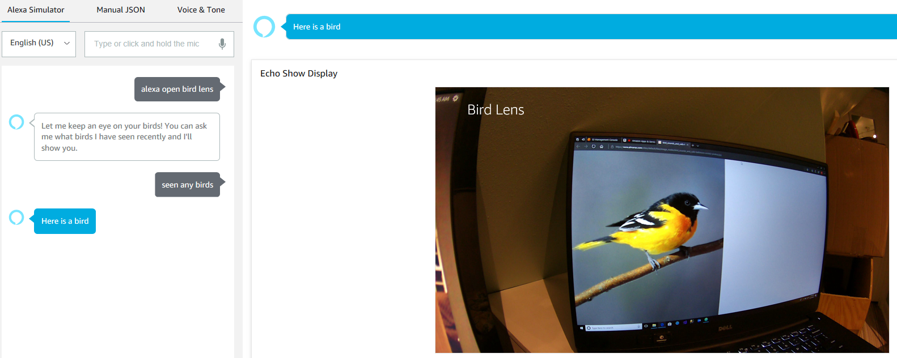

## bird-lens
Ever wonder what birds stop by your feeder while you are away? Me too, so I pieced
together a few AWS services that allow my DeepLens to do the work for me.

### Demo Video

### Configuration
We've got a small bird feeder attached to our kitchen window, and we are often visited
by small to medium sized birds. Here is a cute little bird who stopped by today.

Seeing as the DeepLens requires a power source, this is a very convenient place
to test the application. Note that this application can be extended to work out
"in the wild" on any device running AWS Greengrass.

  

### What's it do?
The DeepLens is constantly running a local Lambda function (Lambda @ "Edge") that uses an
inference model to determine whether or not a bird is in view. All of
this can occur when connected or offline, thanks to the capabilities offered by
AWS Greengrass and the ability for DeepLens to use pre-built predictive models.

When the DeepLens detects a bird in the frame, it will store a picture of the
bird on S3. It does so in a way that allows the Alexa app to access the picture.

At any time, a person can say "Alexa, ask Bird Lens if any birds stopped by". At this point,
the app will check to see if any birds were sighted that haven't already been shown to
the user.

### Technical Details
The object detection model being used is the standard one made available by AWS at *s3://deeplens-managed-resources/models/SSDresNet50*. I took the original object detection
sample and forked it into a solution that checks solely for birds, and when it detects a
bird then it uploads the picture to S3. This customized logic can be found within the
*lens_watcher.py* file inside of the *deep-lens-lambda* Lambda function.

You will also find a reference to the S3 bucket and path to which the picture will be stored. This location will be checked by the Alexa app found within the *alexa-app* code. The Alexa
application is checking to see if any picture exists, and will display it if so.

This application is a bit basic, but it did give me the ability to learn quite a bit about the DeepLens. Primarily, I learned how to integrate the entire AWS ecosystem into the Lambda edge function that runs on the actual device, via the Greengrass SDK.

The primary area that I would like to learn more is around model customization and tuning within SageMaker. Specifically, I would like to learn how to train the object detection model based on actual pictures of birds at my feeder, so that it can learn about my specific use case.

### Problems
When I ran the DeepLens model inference to attempt to detect a bird in my window, the
model was unable to recognize the birds. However, when testing this object detection
algorithm using different types of objects (such as "person" or "cat" or "dog"), those
types of objects were all detected fine.

I was able to get a picture of a bird to trigger my object detection logic, and used that
for my hackathon submission. However, I would like to learn how to improve the object detection model's accuracy when detecting birds in the wild. This is something that I will be using
SageMaker to learn in the future.

### Roadmap
Here are some items that I considered doing, but ran out of time.
* Detect when a squirrel is in view, and send a SMS (text) notification. In case
you aren't a bird watcher, squirrels are notorious for eating massive amounts
of bird food.
* Use AWS Rekognition to annotate images with metadata information that can
be detected by the service.
* Use AWS SageMaker to determine what species of bird is being viewed, and add
that into the mix.
