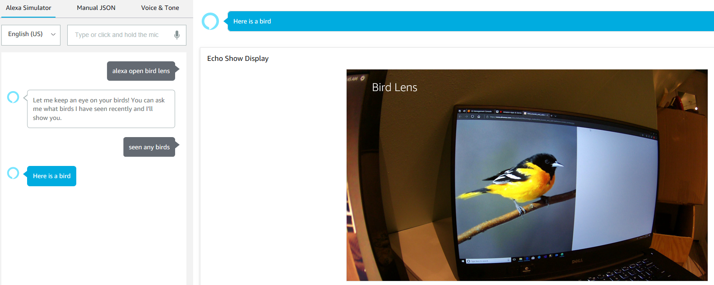

## bird-lens Alexa app
This application will display birds that have been observed by the DeepLens.

### Configuration
In order to use this application, you will need to perform the following
customizations to the code.
* Update *bird_queue_bucket* to your S3 bucket name.
* Update *bird_queue_key* to the S3 key where your bird picture will be stored by the DeepLens project driven by the *deep-lens-lambda* function.

### Examples
me: *Alexa, ask bird lens if any birds stopped by* 
Alexa: *Check out this one.* 

